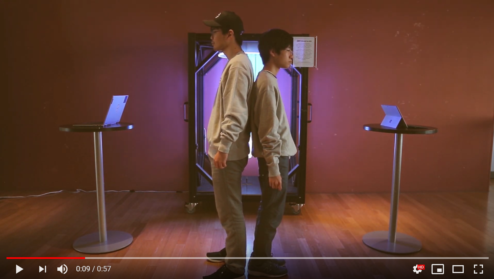

# Quantum Duel: Be the fastest of the Quantum West

## Introduction

Howdy partner! Here we present the first online multiplayer quantum game. Each player is given initial and final quantum states. The objective of the game is to build a quantum circuit to achieve such the transformation. The first to submit the correct circuit wins the duel and becomes the fastest draw in the quantum west!

## Trailer
 

## Gameplay
[[]
- The game begins when two players open the Quantum Duel game web page. 
- The initial and final quantum states are given.
- The players drag and drop the provided quantum gates to make a correct quantum circuit for the problem.
- The FIRST player who gets the correct quantum circuit WINS!

## Technical details

Once the game begins, a problem of the initial and final quantum states are randomly generated by the levels generator module. Next, the user circuit converter transforms the user input circuit into a Qiskit quantum circuit. The answer is then checked. Lastly, the result is sent to the players when the correct answer is detected.    

### Development tools

- The main computing module and the server are developed by **Python with Qiskit and Tornado web server**.
- The front-end languages are **JavaScript, CSS, and HTML**.

## Members
@geduardo  
@TRSasasusu  
@unchalisa  
@yoheiwaka

## Website

[https://quantum-duel.herokuapp.com/](https://quantum-duel.herokuapp.com/)

## Licenses 
- The original western image is taken from: https://www.flickr.com/photos/gameraboy/30084662098/ and is under the license CC BY-NC 2.0. It has been modified to include the Qiskit logo.
Author: John Duillo

- Qiskit is under Apache License 2.0
